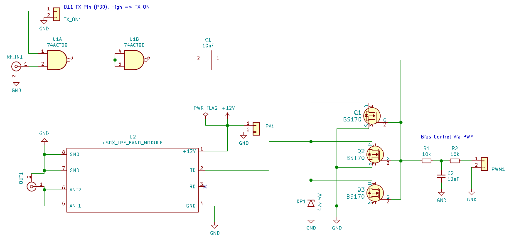
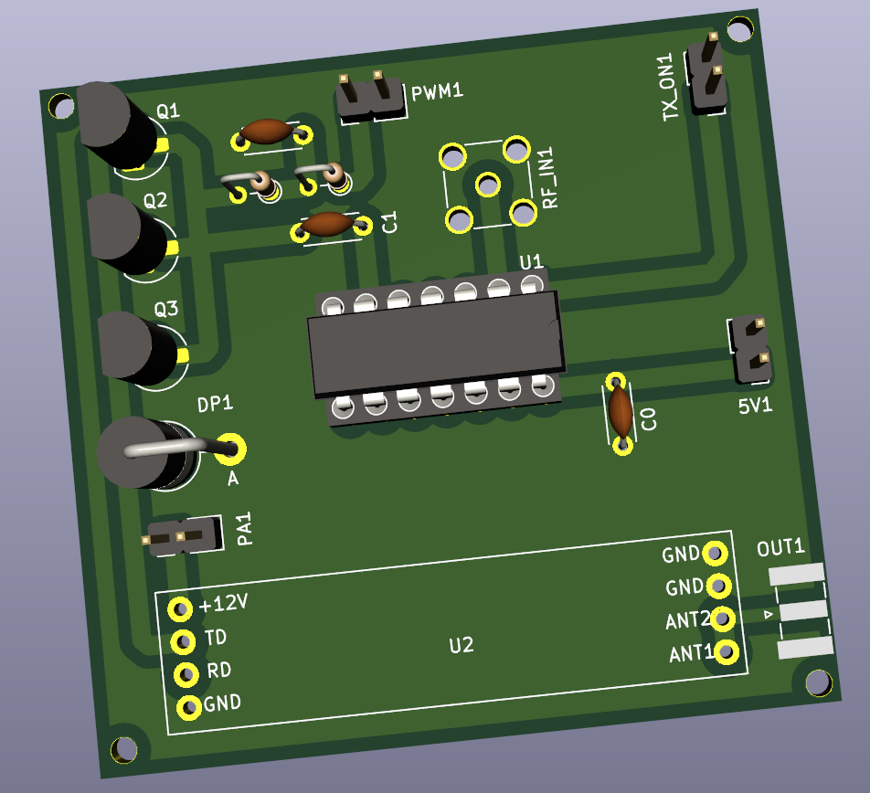
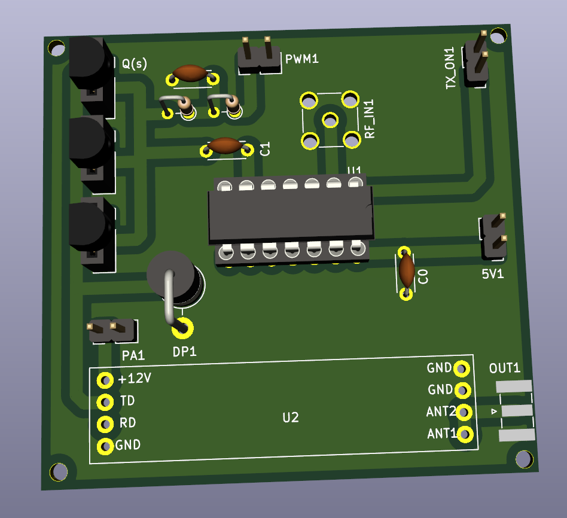
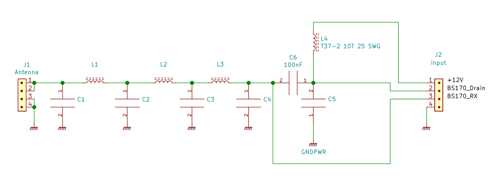
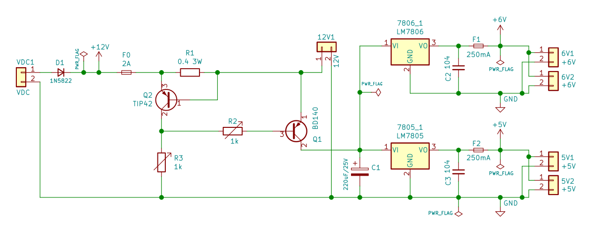
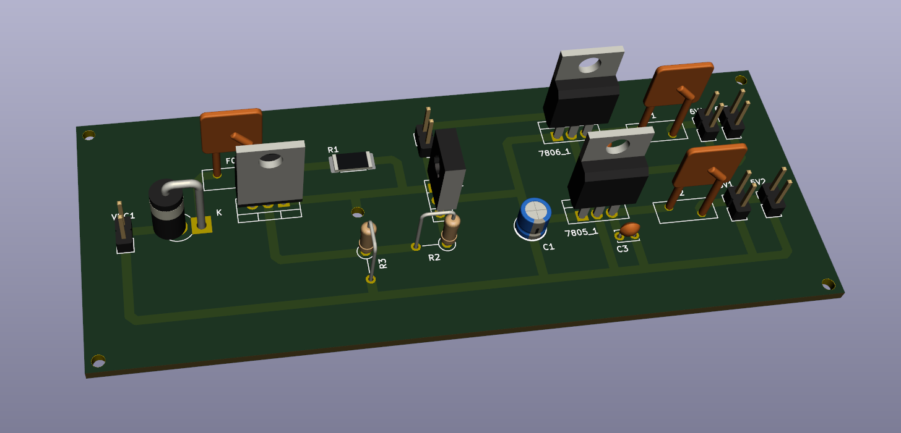
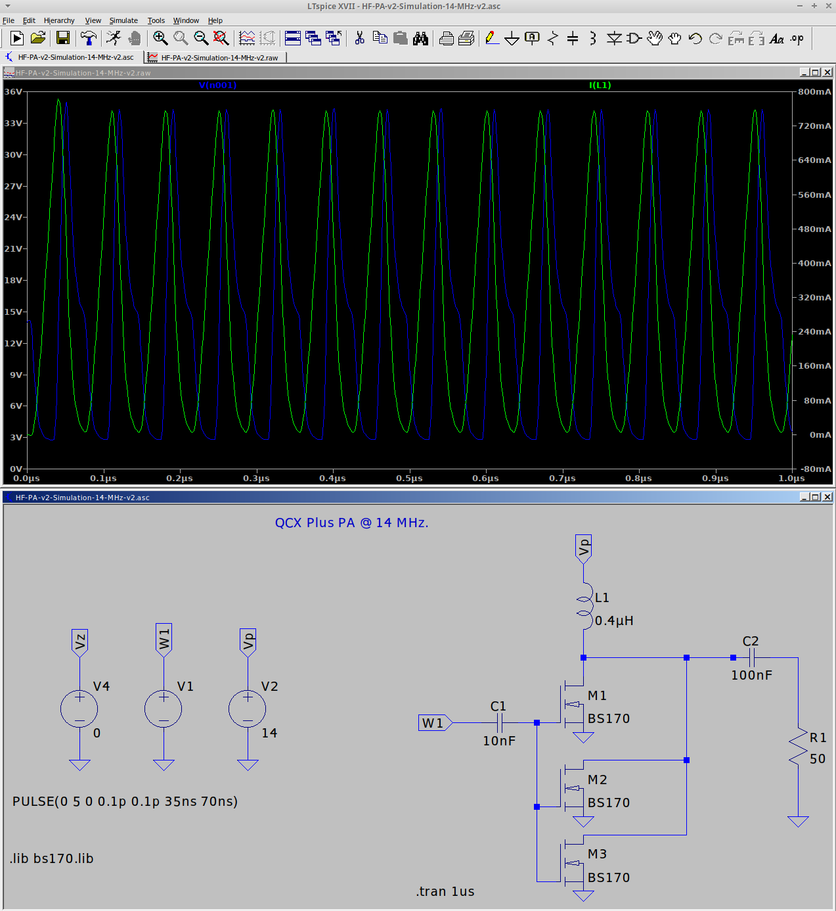
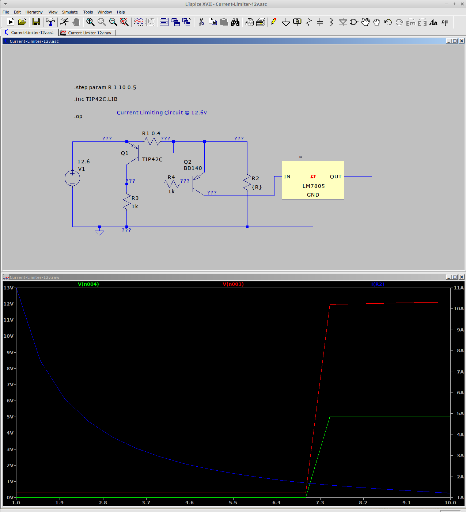

### HF-PA-v2

VU3CER's `Class-E HF PA` for https://github.com/kholia/Easy-Digital-Beacons-v1
project for 20m band and up. It has (optional) software-controlled variable PA
Output Power.

Supported bands: 80, 60, 40, 30, 20, 17m, and more bands with switchable 'LPF
Module' board.

(July 2021 Update): While this HF PA works as well as the uSDX V1.02 PA and the
QCX+ PA (they all use the same design!), we prefer our new [HF-PA-v3
system](https://github.com/kholia/HF-PA-v3/) PA for its robustness. If you
need a 3W+ @ 14 MHz with high efficiency, this Class-E HF PA design
(`HF-PA-v2`) is the best one ;)

Constraints for the initial PCB prototypes for validating the design:

- PCB is to be homebrewed (laser printer, toner tranfer using iron, etching via FeCl3)

- PCB is single-sided. Only one layer is available for routing.

- BS170 MOSFETs need to be on an edge to allow usage of heatsinks.

- My external `PA150 HF Linear Amplifier` needs 2W minimum to function.

Input: Few milliwatts is fine. Note: Si5351's output is around 8-10mW.

Output: Full-power 3.2W+ @ 13.3v (4S LiFePo4) for 20m band (14.074 MHz) with
around 45-55% efficiency *OR* Safer 2W with reasonable PWM setting for digital
modes!

Note: All screenshots are clickable and zoomable.

Note 2: Active cooling (fan) is recommended for digital modes! You have been
informed ;)

Schematic:

The HF PA has over-voltage ("High-SWR") protection via a `47v zener power-dumping diode`.

PCB renderings:

Socketable version (recommended):

Testing the Triple-Mode PSU + LPF 20m + 3xBS170 @ 13.8v:

LPF schematic (from uSDX PCB by WB2CBA):

Safe power supply module for the PA. It has over-current protection.

Note: This 3D rendering is *only* published to help with the manual layout work
on Zero-PCBs.

Note 2: Various sub-circuits were simulated in LTspice prior to implementation.

### Sample Code

- https://github.com/kholia/uSDX_Beacon

- https://github.com/kholia/Easy-Digital-Beacons-v1

#### O(Current consumption)

The ESP8266 usually draws a peak current of about 250mA after it wakes up and
then more or less constantly draws around 70mA before it goes back to sleep.

DS3231 -> 5mA

Si5351 -> ~50 to 100mA

Upper bound -> 1.4A maximum.

#### BOM

- 1 x SN74ACT00N (TI)

- 3 x BS170 (ON Semi)

- 1 x 7805 Voltage Regulator TO-220 (STMicroelectronics)

- 1 x 7806 Voltage Regulator TO-220 (STMicroelectronics)

- 1 x 1N5822

- 1 x 1N5368B (47V 5W Zener Diode)

- 2 x 0.2 Ohms - 3W Current Sensing Resistor

- 2 x 1k Ohm - 0.25W Metal Film Resistor

- 220uF 25v Electrolytic Capacitor

- 5 x 100nF (104) Ceramic Capacitor

- 1 x 10nF (103) Ceramic Capacitor

- 1 x BD140 Transistor

- 1 x TIP42 Darlington Transistor

- 3 x T37-6 - Yellow Toroid, 1 x T37-2 - Red Toroid (LPF)

- 2 x 180pf, 2 x 390pf, 1 x 30pF NP0 Ceramic Capacitors (LPF caps, Kemet)

- 3 meters - Copper Magnetic Winding Wire (24 AWG - 25 SWG)

- Misc: Connectors, Zero PCB, Various Consumables

- Tools: LCR-T4 Meter (for measuring things), RF Power Meter

Tip: Buy in bulk for better pricing, and for getting spares for the "junk box".

#### 20m LPF Module Details

- L1 - T37-6 / 16 turns
- L2 - T37-6 / 17 turns
- L3 - T37-6 / 16 turns
- L4 - T37-2 / 10 turns
- C1 - 180pf
- C2 - 390pf
- C3 - 390pf
- C4 - 180pf
- C5 - 30pf

Borrowed from QCX manual and uSDX WB2CBA PCB documentation.

#### BOM + Equipment Sources

- https://www.semikart.com/ (BS170, NP0 LPF caps - Kemet and others, Aavid DIP-14/16 Heat Sinks)

- https://www.semikart.com/search/SN74ACT00N

- https://robu.in/product/0-2-ohm-3w-surface-mount-sense-resistor-pack-of-3/

- https://www.electronicscomp.com/

  - BS170, regular caps, ST voltage regulators

  - TIP42, BD140

- https://www.electroncomponents.com/ (transistors, connectors, consumables, misc)

- https://www.sunrom.com/ (regular ceramic caps)

- https://projectpoint.in/

  - Transistors, regular caps, voltage regulators, MFR resistors, misc

  - Copper Magnetic Winding Wire

- https://www.bhagwatilightingindustries.com (Thermal Adhesive Paste)

- https://www.sunrom.com/p/254mm-40x1-female-socket-strip-machine-round-pins

  `SIP Sockets 1A`

- eBay (`gr_makis`) - Toroids

- [LCR-T4 LCR Meter](https://www.techtonics.in/lcr-t4-12864-lcd-graphical-transistor-tester-resistance-capacitance-esr-scr-meter)

### Notes

- The `CDIL 2N3904` TO-92 transistor has `CT2N 3904 LS` marking on it.

  `CT` -> `Continental... Device India Ltd (CDIL)`

- `Burnt` BS170 MOSFETs typically have their `Drain` and `Gate` shorted (Pin 1 and Pin 2 respectively).

- Use `SIP sockets` to avoid accidentally killing the MOSFETs via ESD (during probing, soldering, etc).

- PCB test: Remove the MOSFETS (keep everything else connected) and measure the
  resistance between the `Gate Pin` and `Ground`. It should show `OL (Open Line)`.

### Tips

- BS170 MOSFETs are very sensitive with regards to ESD and high soldering
  temperatures.

  Use best practices when dealing with BS170 MOSFETs and perhaps always ;)

#### References

- https://github.com/kholia/uSDX_Beacon
- https://github.com/agustinmartino/wsjt_transceiver
- http://hyse.org/pdf/www.aoc.nrao.edu/~pharden/hobby/_ClassDEF1.pdf
- http://hyse.org/pdf/www.aoc.nrao.edu/~pharden/hobby/_ClassDEF2.pdf
- http://thestone.zone/radio/2020/12/13/multi-watt-amplifier.html
- http://thestone.zone/radio/2020/12/18/gate-driver-amplifier.html
- http://thestone.zone/radio/2021/01/14/capacitors.html
- http://thestone.zone/radio/2021/01/16/minor-enhancements.html
- https://www.g0kla.com/scpa/SimpleCheapPA.php
- https://www.linkedin.com/pulse/rf-pcb-design-rules-manufacturing-process-lisa-chu/
- http://thestone.zone/radio/2021/06/04/attenuator.html
- http://thestone.zone/radio/2021/06/05/power-amplifier.html
- https://on7dq.blogspot.com/2020/12/qcx-mini-measurements.html
- https://www.random-science-tools.com/electronics/dBm-Watts-volts.htm
- https://www.mitsubishielectric.com/semiconductors/php/oSearch.php?FOLDER=/product/highfrequency/siliconrf/discrete
- http://www.carnut.info/WSPR_Tx/WSPR_Tx.htm
- https://sites.google.com/view/andy-g0ftd/iron-fist-transmitter
- https://www.dj0abr.de/english/technik/dds/pa.htm
- https://www.qsl.net/py2ohh/
- https://hf5l.pl/en/transceiver-usdx-with-arduino-nano/#

#### Credits

- MTR5B schematic
- PFR-3 design
- Dan Tayloe, N7VE (NC2030 PA design)
- Hans Summers (QCX+)
- Guido PE1NNZ (uSDX)
- WB2CBA (uSDX PCB)
- Tom (AK2B)
- Various uSDX folks
- Chris (G0KLA / AC2CZ) - over-current protection
